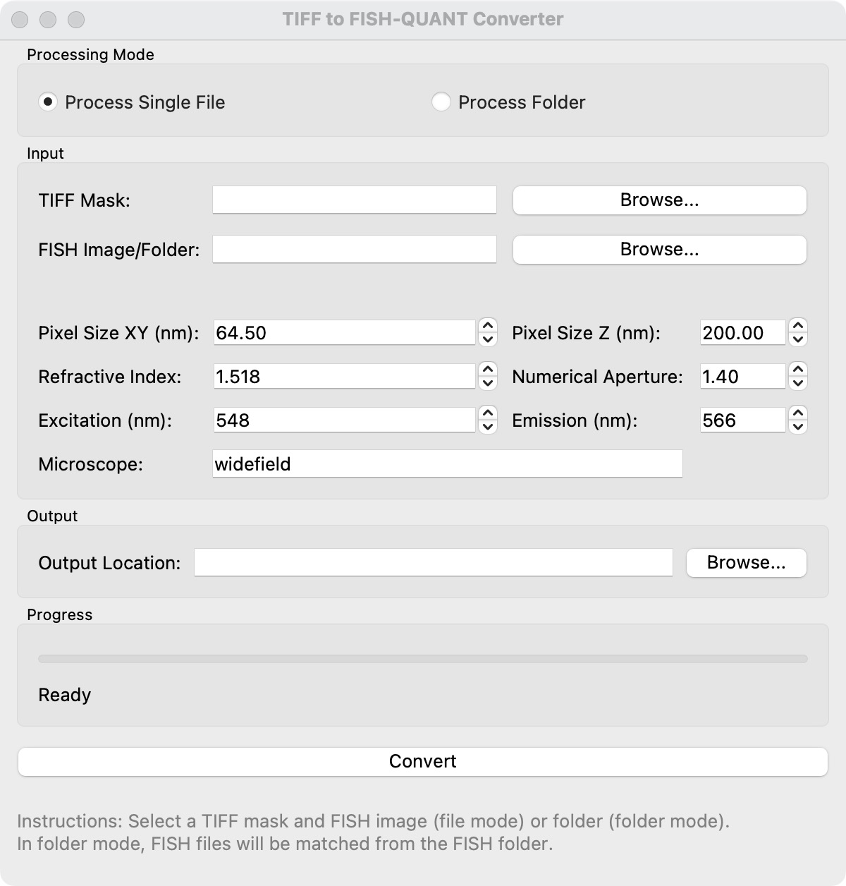

# YeastSAM
YeastSAM is a model and a framework for yeast cell analysis and mask processing. It provides an intuitive GUI launcher and various tools for generating masks, image registration, and outline conversion. This manual provides a step-by-step guide to installing and using YeastSAM, a toolbox designed for cell analysis and FISH-Quant integration. All tools support image series processing.

The pipeline contains 3 main steps:

- **napari** - Creating masks for cells using custom weights for better yeast cell segmentation
- **Mask2Outline** - Converting cell masks into FISH-Quant outline files
- **Mask Editor** - Mask editing using deep learning separation module 

Optional Tools for shifting and image registration:

- **Shift Analyzer** - Quantifying shifts or drifts between DIC/Mask and FISH images  
- **Registration** - Aligning shifted images

For any issues, feel free to email us at [sc22yz3@leeds.ac.uk](mailto:sc22yz3@leeds.ac.uk) or [Zhouyuan.Zhu@tufts.edu](mailto:Zhouyuan.Zhu@tufts.edu).

## Dataset
The dataset used for training and validation can be found at [Zenodo](https://zenodo.org/records/17204942), including DIC and the masks.

## Quick Start

If you just want to run YeastSAM, you can refer to [µSAM](https://github.com/computational-cell-analytics/micro-sam) to install the framework. We provide custom weights for better yeast cell segmentation that can be downloaded from our [GitHub Releases](https://github.com/YonghaoZhao722/YeastSAM/releases). 

The custom weights can be used with:
[napari](#setting-up-napari-for-mask-generation),
[BAND](https://computational-cell-analytics.github.io/micro-sam/micro_sam.html#using-micro_sam-on-band),
[CLI](https://computational-cell-analytics.github.io/micro-sam/micro_sam.html#using-the-command-line-interface-cli), and [QuPath](https://github.com/ksugar/qupath-extension-sam).

## Installation

### With Conda

Run the following commands in your terminal:

```bash
git clone https://github.com/YonghaoZhao722/YeastSAM.git
conda create -n yeastsam -c conda-forge -c defaults python=3.10 micro_sam
conda activate yeastsam
```

**Note**: On macOS, these tools are not compatible with Python 3.13. If you follow the installation command above, everything should work correctly. However, if you directly use the conda instructions from the [µSAM tutorial page](https://computational-cell-analytics.github.io/micro-sam/micro_sam.html), you may run into errors. In that case, please downgrade your Python version to 3.10 and recreate the environment.

## Usage

### **Launch the GUI**

To start the YeastSAM tools launcher:

```bash
python launch.py
```

This will open a GUI with four main sections:


#### 1. Generate Masks
- **napari**: Opens napari viewer for interactive mask generation and editing. You can load our custom weight YeastSAM for better accuracy in budding yeast.

#### 2. Optional Tools
This section is to fix the offset between smFISH image and DIC (as masks are generated from DIC).

- **Shift Analyzer**: Analyze and detect shifts in your image data

- **Apply Registration**: Apply image registration corrections

#### 3. Convert to Outline File
- **Mask2Outline**: Convert mask files to FISH-Quant compatible outline format

#### 4. Separation Module
- **Mask Editor**: You can annotate mask images manually or with CNN & U-Net separation module. Download models at [GitHub Releases](https://github.com/YonghaoZhao722/YeastSAM/releases).

### **Setting Up napari for Mask Generation**

Under *Analysis Tool*, choose *napari*. The first launch of napari may also take some time to build.

**napari** is an interactive interface used in this workflow to generate masks for each cell on DIC images. For detailed information, check [µSAM annotation tools documentation](https://computational-cell-analytics.github.io/micro-sam/micro_sam.html#annotation-tools) created by the µSAM project. They also provide video tutorials.

To start:

1. Open napari, then click *File > Open File* (or drag and drop a file) to load a DIC image.
2. Go to *Plugins > Segment Anything for Microscopy*.
3. Select *Annotator 2D* (for single files) or *Image Series Annotator* (for all files in a folder).
4. Use *Annotator 2D* for this step. It may take a moment to load—this is normal.
5. Ensure your image layer is at the bottom of the layer list. If not, drag it to adjust.


#### **Configuring Embedding and Segmentation Settings in napari**

Once napari is open and your DIC image is loaded, configure the embedding settings for mask generation. Follow these steps:

1. Click **Embedding Settings** in the sidebar.

2. Choose the following options (summarized in the table below):

| Setting             | Option                                                                                                                                  |
|---------------------|-----------------------------------------------------------------------------------------------------------------------------------------|
| Model Size          | Select `base` |
| Custom Weights Path | Select `vit_b_yeast.pt`. **Important**: Download these weights from [GitHub Releases](https://github.com/YonghaoZhao722/YeastSAM/releases). These custom YeastSAM weights are fine-tuned for Yeast Cell DIC images, offering improved accuracy over default µSAM models for budding yeast. |

*Note:* If you skip loading custom weights, napari will download the default µSAM model files, which may cause a few minutes of unresponsiveness. To avoid this, always use the provided YeastSAM weights.


3. After setting the model size and weights, click *Compute Embeddings*. This process takes a few seconds to complete.

4. Once embeddings are computed, click **Automatic Segmentation Settings**, set the configuration as shown. These settings are proven to be most accurate on the training DIC images in general.


For steps beyond these YeastSAM-specific operations, refer to this tutorial video: [Annotator 2D tutorial](https://www.youtube.com/watch?v=9xjJBg_Bfuc)

Once you've completed the annotation, you can save the **committed_objects** layer. This is the mask file generated. We will then use it to create outline files.

### **Converting Masks to FISH-Quant-Compatible Outlines**

To convert your masks into outline files compatible with FISH-Quant, click *Mask2Outline* and follow these steps:



**Input:**

- For *TIFF Mask*, select the mask file (or folder, if processing multiple masks) you generated earlier in napari.

- For *Metadata (FISH Image/Folder)*, select a FISH image (or folder). This is required because FISH-Quant uses metadata from the outline file to open the corresponding FISH image. If you're processing a folder, the program will automatically match FISH images to masks based on their filenames.

  **Note**: If processing a folder of masks, ensure the masks were generated using **Image Series Annotator** in napari. This preserves the original filenames, allowing the program to correctly match masks with their corresponding FISH images.

**Output:**

- Choose a folder where the program will save the converted outline files. These will be in a TXT format compatible with FISH-Quant.

2. Once all fields are set, click **Convert** to start the conversion process.

The resulting outline files can now be used directly in FISH-Quant for further analysis.


### **Mother-Bud Pair Separation**

<video width="100%" autoplay loop muted>
  <source src="videos/separation.mp4" type="video/mp4">
</video>

  

You can use the **Mask Editor** to separate *mother-bud pairs*, either manually or automatically:

- On the left *Editing Tools* panel, you can select **Select**, **Erase**, **Divide**, or **Drag** (when zooming in).  
  You can manually use the **Divide** tool to separate mother-bud pairs. This is how we collected the data for analysis and for training the CNN and U-Net models.  

- On the right panel, you can load [models](https://github.com/YonghaoZhao722/YeastSAM/releases) for automatic detection and separation:  
  - The **Classification** section detects which masks are mother-bud pairs.
  
  *Note*: You can also manually assign class **budding** or **G1** to the selected mask with the **Manual Classification** panel.
  
  - The **Dividing Line Cell Separation** section separates the detected **budding** cells.  

In addition, the **Auto Renumber Cells** button (bottom left) will reorder masks based on the position of their first pixel, following the cell numbering logic used by FISH-Quant.  
In our annotations, we set the *bud* to have the **01** suffix and the *mother cell* to have the **02** suffix, which facilitates [downstream data preprocessing and module model training](https://github.com/YonghaoZhao722/YeastSAM/tree/main/cell_separation).


### **Shift Analyzer and Registration (Optional)**


YeastSAM provides tools to correct misalignment between masks and FISH images, ensuring accurate outline files for FISH-Quant. This section covers the **Shift Analyzer** and **Registration**.

#### Shift Analyzer for Visual Alignment

1. Load your mask and the corresponding FISH image as the background. The program will generate an overlay of the mask on the FISH image.

2. Drag the mask over the FISH image to visually inspect any misalignment and determine the offset between them.

3. Once you've identified the correct offset, click *Apply Registration*.

#### Registration for Applying Offsets

1. The program will generate a *registered mask* by applying the offset, aligning the mask with the FISH image.

2. Use this registered mask in the *Mask2Outline* tool (as described in the "Converting Masks to FISH-Quant Outlines with Mask2Outline" section) to convert it into an outline file. The resulting outline will now align perfectly with the FISH image in FISH-Quant.

The tool also supports processing folders, where the same offset coordinates are applied to all masks.


## Citation
If you are using YeastSAM or the dataset for your research, please cite [our paper](https://www.biorxiv.org/content/10.1101/2025.09.17.676679v1):

Zhao, Y., Zhu, Z., Yang, S., Li, W. YeastSAM: A Deep Learning Model for Accurate Segmentation of Budding Yeast Cells. bioRxiv 2025.09.17.676679 (2025). https://doi.org/10.1101/2025.09.17.676679
