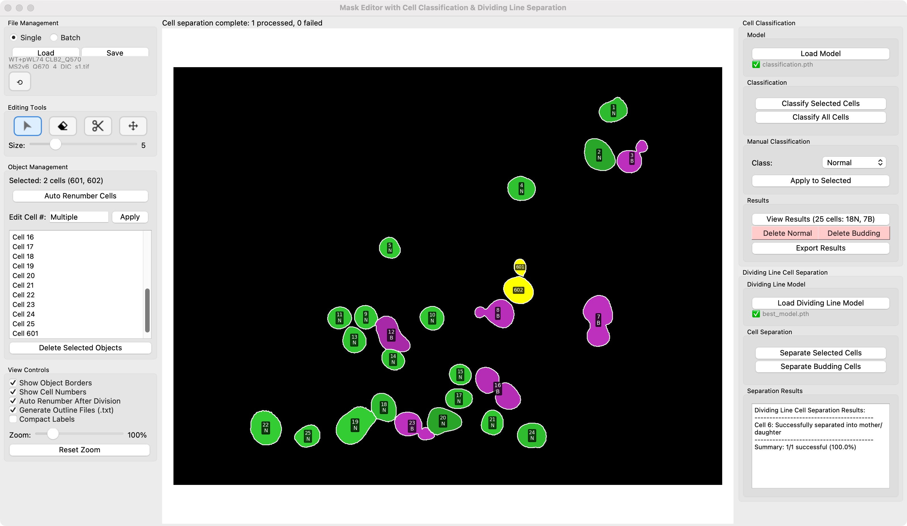

This manual provides a step\-by\-step guide to installing and using AutoOutline, a MacOS toolbox designed to set up the analysis environment and contains 4 tools: 

__Micro\-SAM__ __Napari__

__Shift Analyzer__

__Registration__

__Mask2Outline__

for converting masks into outline files compatible with FISH\-Quant\. 

For any issues, feel free to email me at sc22yz3@leeds\.ac\.uk

## AutoOutline Installation and Napari Setup

To download AutoOutline, use this link:  

[https://drive\.google\.com/file/d/1p68MWEPVD3cKDND40Gbtgrc\_WwkO2O1P/view?usp=sharing](https://drive\.google\.com/file/d/1p68MWEPVD3cKDND40Gbtgrc\_WwkO2O1P/view?usp=sharing)

Download __*AutoOutline\.dmg*__, open it, and drag the AutoOutline app to your Applications folder\. The first time you launch it, the app will prompt you to install Miniconda and set up the Micro\-SAM environment\. This may take a few minutes—please be patient\. Once complete, a window will pop up allowing you to select a tool\.

Under *Analysis Tool*, choose *Napari*\. The first launch of Napari may also take some time to build\.

**Napari** is an interactive interface used in this workflow to generate masks for each cell on DIC images\. For detail information, check 

[https://computational\-cell\-analytics\.github\.io/micro\-sam/micro\_sam\.html\#annotation\-tools](https://computational\-cell\-analytics\.github\.io/micro\-sam/micro\_sam\.html\#annotation\-tools) created by Micro\-SAM project\. They also provide video tutorial\.

 To start:  

Open Napari, then click *File > Open File* \(or drag and drop a file\) to load a DIC image\.  
Go to *Plugins > Segment Anything for Microscopy*\.  
Select *Annotator 2D* \(for single files\) or *Image Series Annotator* \(for all files in a folder\)\.  
Use *Annotator 2D* for this step\. It may take a moment to load—this is normal\.  
Ensure your image layer is at the bottom of the layer list\. If not, drag it to adjust\.

## Configuring Embedding and Segmentation Settings in Napari

Once Napari is open and your DIC image is loaded, configure the embedding settings for mask generation\. Follow these steps:

Click Embedding Settings in the sidebar\.  

Choose the following options \(summarized in the table below\):

| Setting             | Option                                                                                                                                  |
|---------------------|-----------------------------------------------------------------------------------------------------------------------------------------|
| Model Size          | Select `base` or `large`. Large offers higher accuracy but is computational-heavy. Base runs faster with acceptable accuracy. An M2 MacBook Air 16G can run large without issues. If you experience crashes with large, switch to base. |
| Custom Weights Path | For large, select `l_yeast_finetuned.pt`. For base, select `b_yeast_finetuned.pt`. **Important**: Download these weights from: [Google Drive](#). These custom weights are fine-tuned for Yeast Cell DIC images, offering improved accuracy over default Micro-SAM models. |

After setting the model size and weights, click *Compute Embeddings*\. This process takes a few seconds to complete\.  

Once embeddings are computed, proceed to __Automatic Segmentation Settings__, set the configuration as shown, they are proved to be most accurate on the training DIC image in general\.

| Large                                                                 | Base                                                                  |
|----------------------------------------------------------------------|----------------------------------------------------------------------|
|  |  |

If your options doesn't look like this, please compute embedding first\.

These settings are optimized for our custom weights \(*l\_yeast\_finetuned\.pt* or *b\_yeast\_finetuned\.pt*\)\. If you skip loading custom weights, Napari will download the default Micro\-SAM model files, which may cause a few minutes of unresponsiveness\. To avoid this, always use the provided custom weights\.

For steps beyond these AutoOutline\-specific operations, refer to this tutorial video: [https://www\.youtube\.com/watch?v=9xjJBg\_Bfuc](https://www\.youtube\.com/watch?v=9xjJBg\_Bfuc) \(Annotator 2D tutorial\)

Once you've done the annotation, you can save the __commited\_objects__ layer, this is the mask file generated\. We will then use it to create outline file\.

## Converting Masks to FISH-Quant Outlines with Mask2Outline

To convert your masks into outline files compatible with FISH\-Quant, reopen AutoOutline and follow these steps:

In the AutoOutline main window, select *Utility Tool > Mask2Outline*\. This will open a new window as shown:

__Input__:  

  For *TIFF Mask,* select the mask file \(or folder, if processing multiple masks\) you generated earlier in Napari\.  

  For *Metadata \(CY3 Image/Folder\)*, select a FISH image \(or folder\)\. This is required because FISH\-Quant uses metadata from the outline file to open the corresponding FISH image\. If you're processing a folder, the program will automatically match FISH images to masks based on their filenames\.  

  __*Note*__: If processing a folder of masks, ensure the masks were generated using __Image Series Annotator__ in Napari\. This preserves the original filenames, allowing the program to correctly match masks with their corresponding FISH images\.  

__Output__:  

  Choose a folder where the program will save the converted outline files\. These will be in a TXT format compatible with FISH\-Quant\.  

Once all fields are set, click **Convert** to start the conversion process\.  

The resulting outline files can now be used directly in FISH\-Quant for further analysis\.

## Shift Analyzer and Registration \(Optional\)

AutoOutline provides tools to correct misalignment between masks and FISH images, ensuring accurate outline files for FISH\-Quant\. This section covers the *Shift Analyzer* \(under Analysis Tool\) and *Registration* \(under Utility Tool\)\.

### Shift Analyzer for Visual Alignment

In AutoOutline, go to *Analysis Tool > Shift Analyzer*\.  

Load your mask and the corresponding FISH image as the background\. The program will generate an overlay of the mask on the FISH image\.  

Drag the mask over the FISH image to visually inspect any misalignment and determine the offset \(shift\) between them\.  

Once you've identified the correct offset, click A*pply Registration*\. This will automatically start *Registration* tool and apply the offset values\.

**Registration for Applying Offsets**

In AutoOutline, go to *Utility Tool > Registration*.  

The program will generate a *registered mask* by applying the offset, aligning the mask with the FISH image.

Use this registered mask in the *Mask2Outline* tool (as described in Chapter 3) to convert it into an outline file. The resulting outline will now align perfectly with the FISH image in FISH-Quant.  

Also support processing folder, the same offset coordinates is applied to all masks.

